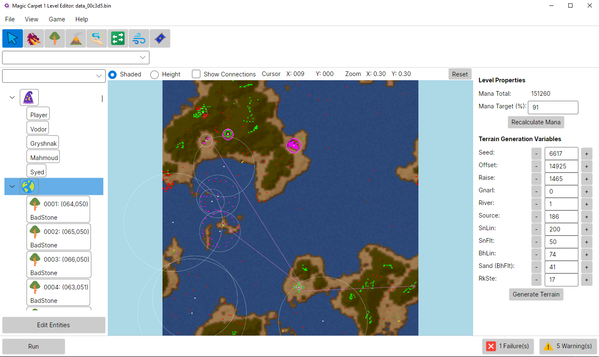

# MCLevelEdit
A C# Level Editor for the Bullfrog Productions game Magic Carpet. 30 years late, but better late than never. It is written in Avalonia and C#. Currently this only works for the original Magic Carpet (but ironically uses the MC2 terrain generation algorithem). In the future versions, Hidden worlds should be possible.

Without Moburma's research and his original repo https://github.com/Moburma/MCLevelEdit this could not have been written. The Level Packager and Loading and Saving code is converted from Moburma's.
### Join us on discord: [https://discord.gg/WH9mxNaS](https://discord.gg/W68ZWrngER)

## Download the latest version Here! ##
https://github.com/thobbsinteractive/MCLevelEdit/releases/latest

## Usage
* Simply run the installer and click the Magic Carpet Level Editor icon to start
* Most of the editor is fairly easy to use. The editor should load with randomly generated Terrain.
* To play levels, simply configure the Game Settings via its menu and click then [Run]. On the main menu click the Globe to run your level!
* Keep in mind that a large number of the game's levels work by only giving the player the spell inventory they have found at that point, and ignore what is set in the level file. When you use the [Run] button, your level will be the first one in the game and the player will always start with NO spells, regardless what is set in the level file. So include the spells on the ground at map start.

## Creating a basic level
* Check out the [Wiki](https://github.com/thobbsinteractive/MCLevelEdit/wiki) for guidance on creating your first level

## Editing Magic Carpet 1 Levels
* If you want to load and edit the MC1 Levels, you will need the original loose level files. These are NOT included with Magic Carpet Plus, but can be found on the original Magic Carpet CD in the LEVELS directory. Either that, or you can extact them yourself with Moburma's [MCDatTab](https://github.com/Moburma/MCDatExtractor) tool (I plan on adding decompression and extraction of levels to the PagkageAdapter at some point).
* You will need to decompress the levels to edit them. They are RNC compressed and there are many tools available to achieve this, [this](https://github.com/lab313ru/rnc_propack_source) tool is recommended

For information on game entities and attributes, see [here](https://tcrf.net/Notes:Magic_Carpet_(DOS)) and [here](https://github.com/michaelhoward/MagicCarpetFileFormat/blob/master/magic%20carpet%20file%20format.txt).

Map Key: 
Red - Creature (enemies but also villagers) 
Yellow - Player start (including computer controlled wizards) 
Green - Scenery (includes trees and standing stones) 
Purple - Spells 
Cyan - Effect (things like explosions but also extra map elements like canyons and walls) 
White - Switch (hidden switches) 

# ROADMAP:

## MILESTONE 1
- [x] Currently the Mana Calculation is wrong. More investigation is needed with the existing levels.
- [x] Implement click and drag of Entities to move them on the map
- [x] Double Click on error/warning to select entity with said Error/Warning
- [x] Add filter drop downs to the Tree and the Edit Entities views.
- [x] Add custom tools for creating Walls/Paths and Teleports.
- [x] Add validation rules for Walls/Paths and Teleports.

## MILESTONE 2
- [ ] Adding decompression and extraction of levels to the PagkageAdapter so you can directly open from the Editor

## MILESTONE 3
- [ ] Implement editing and running Hidden Worlds
- [ ] Reverse engineer the MC1 terrain generation as there are slight differences (snow for instance)

## Build Status:

|Branch|Windows|
|------|:-----:|
|master|
|development|

# Steps: to build and run this code #
## Windows:
- 1: Install the latest version of Visual Studio 2022 Community. Download and install .Net 7 SDK
- 2: Pull the development branch
- 3: Open "MCLevelEdit.sln"
- 4: Set the MCLevelEdit.Desktop as the startup project
- 5: Build/run the code
- 6: Purchase a copy of Magic Carpet 1 from GOG here: https://www.gog.com/game/magic_carpet

## Linux:
- 1: Avalonia should compile and run on Linux, but I have not tested it.
